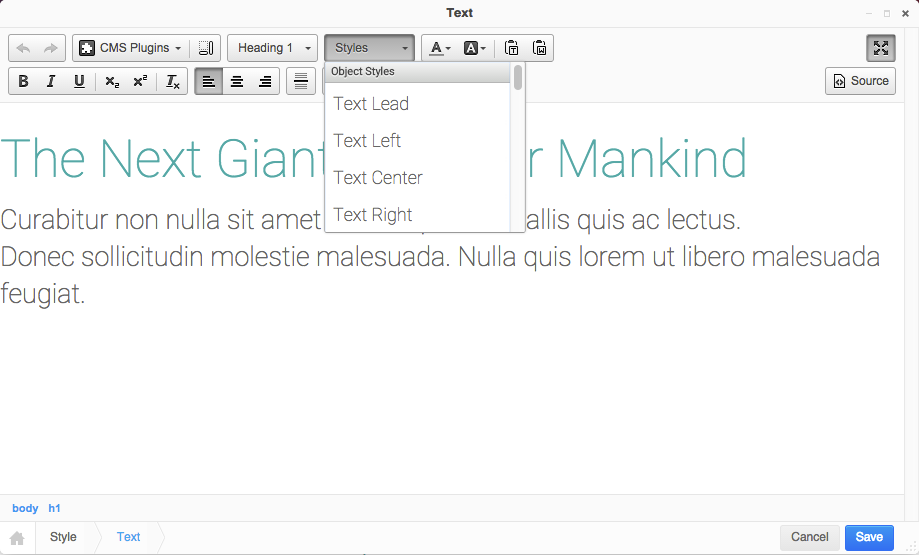

*************
Configuration
*************

.. note::

    The Boilerplate ships pre-configured and runs out of the box if the :doc:`installation` steps are followed
    properly. However most components can be freely configured.

WYSIWYG
=======

The CMS allows for custom style sets within the editor. This allows the user to choose certain presets or colours. We
have already added the general Bootstrap utilities. The file can be found at
``/static/js/addons/ckeditor.wysiwyg.js``.

