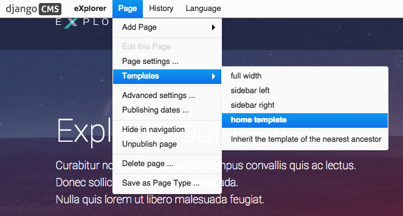
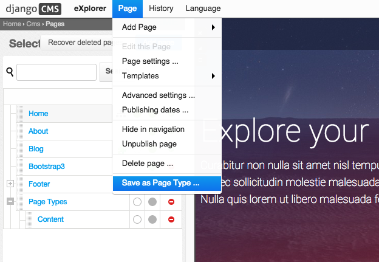

*********
Templates
*********

.. note::

    Aldryn Boilerplate Bootstrap 3 follows django CMS good practices, and
    provides three layers of site template inheritance using ````.
    See `Django template engine <https://docs.djangoproject.com/en/dev/topics/templates/>`_.

From the top down the three layers are:

- *user-selectable page templates* (``fullwidth.html``, ``sidebar_left.html``
  and so on), which inherit from:
- ``base.html``, which inherits from:
- ``base_root.html``

==================
``base_root.html``
==================

``base_root.html`` sets up the components that will rarely if ever need to be
changed, and that you want to keep out of sight and out of mind as much as
possible.

It contains fundamental HTML elements (``<html>`` ``<body>`` and so on) so that
these don't need to be managed in inheriting templates.

It is also intended to be almost wholly content-agnostic - it doesn't know or
care about how your site's pages are going to be structured, and shouldn't
need to. To this end it provides an empty ````,
that inheriting templates will override to provide the page's content.

In addition, Addons such as `Aldryn News & Blog <https://github.com/aldryn/aldryn-newsblog>`_
in the Aldryn Collection family of applications are designed to use the same
JavaScript frameworks throughout, so there is no need for references to them
to be made anywhere else than ``base_root.html``.

=============
``base.html``
=============

``base.html`` is the template that *designers* will be most interested in.
It fills in the bare HTML elements of ``base_root.html``, and allows page
content structures and layouts (headings, ``divs``, navigation menus and so on)
to be created within ````.

``base.html`` contains an *empty* ````, that - in templates
that extend it - is filled with ```` as well as width
cues for images etc.

==============================
User-selectable page templates
==============================

Finally, users can select templates that inherit from ``base.html``.
Even if your project has one 'standard' template and some minor variations,
it is wise for *all* of them to inherit from a ``base.html``, so that they
can all be edited independently. Even if your 'standard' template changes
nothing in ``base.html``, you should not be tempted to make ``base.html``
selectable by the user.

The following templates are always required:

- ``404.html`` for 404 error handling. You are not obliged to construct an
  elaborate and hilarious tribute to some trope in popular culture, because you are an adult.
- ``500.html`` for critical errors, **only add generic html without template tags**
- ``base.html`` as entry point for ````

=========
includes/
=========

Global inclusion files should be added here, for example the
`navigation <http://django-cms.readthedocs.org/en/develop/reference/navigation.html>`_,
`django messages <https://docs.djangoproject.com/en/dev/ref/contrib/messages/>`_
or tracking codes. Create additional */include* folders within addons to avoid
overcrowding this directory.

==============
Page Templates
==============

django CMS allows you to set
`CMS_TEMPLATES <http://docs.django-cms.org/en/latest/reference/configuration.html#cms-templates>`_
which can be chosen within the CMS by the user.

The following templates are provided from the start:

- ``fullwidth.html`` uses the 100% span of the Bootstrap grid
- ``sidebar_left.html`` creates a left sidebar with the content placed on the right
- ``sidebar_right.html`` creates a right sidebar with the content placed on the left
- ``tpl_home.html`` specific template for the landing page

==========
Page Types
==========

You can save a CMS page as "Page Type" and re-use it later when creating a
new page. Simply select *Page > Save as Page Type ..* and choose a name.
You can create a new page by selecting *Page > Add Page > New Page* and choose
the "Page type" you want to use. That drop down does not show up if there are
no page types saved.

Page types are listed separately within the menu tree underneath *Page Types*.
This allows you to change or delete them at any time if required.

=======================
Blocks and Placeholders
=======================

The content block ```` and placeholder
```` always need to be present within page templates.
